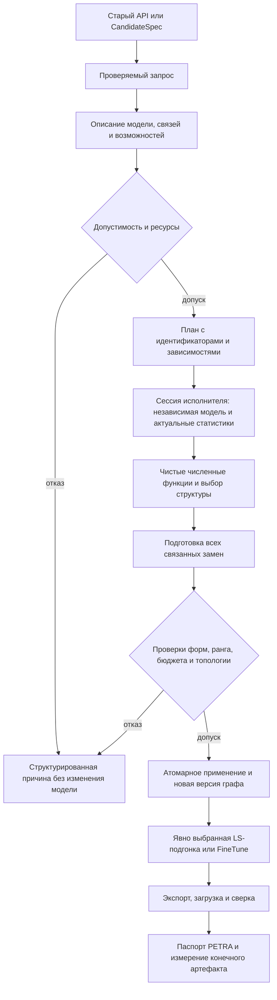

# Архитектура низкоранговых методов FedCore

Статус: **предложение к реализации**, 09.10.2026. Основание — PR [#86](https://github.com/v1docq/FedCore/pull/86), коммит `8c0e748d6400fdb28fe17c54e2b3cfbb1a0eda08`, и сопоставление 24 обзоров в [METHODS.md](METHODS.md). В этом этапе код не менялся, обучение, тесты и измерения не запускались. Наличие реализации или теста ниже установлено чтением кода; оно не означает нового успешного запуска.

Сводная задача: [#108](https://github.com/v1docq/FedCore/issues/108). Номера всех 31 подзадачи, зависимости и покрытие методов приведены в [ISSUES.md](ISSUES.md).

## Решение и сохраняемая граница

Расширять `fedcore/algorithm/low_rank` небольшими тематическими модулями. Сохранить `LowRankModel`, `LowRankTemplate`, `IDecomposed`, `decompose_module`, существующие слои, PETRA и внешний модуль. Старые конфигурации преобразуются в новые проверяемые значения на границе. Не менять смысл `energy`: это историческая масса softmax; `explained_variance` использует квадраты сингулярных значений. Не выдавать обученный коэффициент `S` за спектр: сначала нужен фактический оператор или эквивалентная канонизация его факторов.

Разделить шесть решений: **что приближать → в какой метрике → каким численным алгоритмом → как выбрать структуру → как выполнить преобразование → как сохранить и исполнить результат**. В существующем `decomposer.py` уже есть API tdecomp и реестр решателей. Новые цели не становятся ещё одним параллельным реестром решателей. Зависимость FedCore → tdecomp остаётся односторонней.

Обычная замена оператора, добавление остаточной ветви, согласованное преобразование графа, диагностическое вмешательство и создание новой архитектуры — разные варианты запроса. LRT не требует готового плотного checkpoint. LightFormer получает отдельный путь переноса и построения групп с общими параметрами. LASER возвращает прежде всего результат выбора вмешательства. SliceGPT сначала проверяет эквивалентный поворот полного графа, затем допускает приближённое уменьшение ширины.

## Минимальное размещение

Названия новых файлов являются предложением. На P0/P1 достаточно пяти модулей; поздние семейства добавляются по мере реализации. Один модуль может содержать несколько небольших записей и функций.

| Место | Ответственность и реальные потребители |
|---|---|
| `low_rank/plans.py` | Проверяемые запросы, варианты цели, структуры, ресурсы и ссылки на снимки. Рабочее взвешенное приближение и ASVD; позднее остаточная ветвь и преобразования блока внимания. |
| `low_rank/statistics.py` | Чистые накопления, слияние и завершение явно различённых статистик. Второй момент SVD-LLM/EoRA; центрированные моменты AFM/CTR AFM. Сбор на модели сюда не входит. |
| `low_rank/approximation.py` | Небольшие функции спектрального решения, факторизации PSD-метрики, проекции, диагонального масштабирования и LS. SVD-LLM/DRONE; AFM/ESPACE; MoDeGPT/SVD-LLM v1. Это не один универсальный `weighted_svd`. |
| `low_rank/allocation.py` | Допустимые целые кандидаты, фактическая стоимость, простой выбор по общему бюджету. ASVD/AAFM и Basis Sharing; позднее роль-группы SVD-LLM V2. Модельные оценки поступают как данные. |
| `low_rank/execution.py` | Владение копией модели, сбором, буферами, заменами и обучением. Взвешенная замена оператора и остаточный профиль; общие стадии, но разные конкретные операции. |
| Уже существующие `svd_tools.py`, `rank_pruning.py`, `decomposed_layers.py`, `reassembly/` | Карта замен и загрузка, старые критерии, исполняемые слои и согласованные преобразования. Расширять эти границы, а не заводить новые параллельные менеджеры. |
| PETRA, `CheckpointManager`, `external_runtime`, существующий экспорт | Версии плана и статистик, восстановление, переносимость и доказательства. Преобразование нового семейства подключается адаптером к текущим механизмам. |

Семейства ASVD/FWSVD, AFM/Bolaco, EoRA/ViT получают локальные функции с собственными аргументами. При росте файла они выделяются в тематические `diagonal.py`, `projection.py`, `residual.py`. ARS, Dobi и RankDyna имеют отдельные циклы обучения, а архитектурные операции остаются в `reassembly/`. Этот список не требует заранее создавать пустые файлы, базовые классы, фабрики и реестры для всех статей.

## Данные плана и численные результаты

План хранит пути, устойчивые идентификаторы, формы, версии, параметры и решения. В нём нет `nn.Module`, обработчиков, оптимизаторов, загрузчиков данных, учителей, CUDA-сессии или функции обратного вызова с эффектами. Снимки статистик и факторов обозначаются ссылками вида `TensorRef` с идентификатором и паспортом. Живые тензоры принадлежат сессии исполнителя. `frozen=True` сам по себе не делает тензор неизменяемым.

Псевдосигнатуры показывают границы, а не новую публичную реализацию:

```text
decode_legacy_config(raw) -> LowRankRequest | Violations
validate_request(request, ModelDescriptor, Capabilities) -> ValidatedRequest | Violations
plan_transform(ValidatedRequest, TopologyDescriptor, ResourceLimits)
    -> TransformPlan | PlanningFailure

TransformRequest =
    ReplaceOperator | AddResidual | CoupledGraphTransform
    | DiagnoseIntervention | BuildArchitecture

StructureChoice =
    FixedRank | RankCandidates | SharedBudget
    | ExplicitMask | GraphWidth

TransformPlan = ordered StepSpec + snapshot refs + topology constraints
             + statistics requests + resource limits + export requirements

solve_weighted(W, InputSecondMoment, rank, MetricPolicy) -> ApproximationResult
solve_diagonal(W, DiagonalMetric, rank) -> ApproximationResult
affine_pca(W, bias, CenteredOutputMoments, rank) -> AffineProjectionResult
fit_left_factor(design, target, FitPolicy) -> LeastSquaresResult
allocate(candidate_tables, UniqueStorageCost, budget) -> Allocation | BudgetInfeasible

execute(TransformPlan, model, RuntimeServices) -> ExecutionResult
```

Новые записи не требуют общей библиотеки Result. Независимые нарушения конфигурации можно накопить; зависимый этап прекращается при первом предметном отказе. Примеры отказов: `UnsupportedProfile`, `TopologyConflict`, `StaleStatistics`, `BudgetInfeasible`, `NumericalDomainViolation`. Сбой устройства или файловой системы остаётся ошибкой окружения и получает существующий статус задания.

`SpectralResult` описывает разложение конкретной матрицы: ортонормированные направления, упорядоченный неотрицательный спектр, норму хвоста и точность решателя. `FactorPair` описывает только `L(Rx)+b` и его формы. После обучения или обратного масштабирования `L,R` обычно не являются SVD. `ProjectionBasis` описывает ортонормированное пространство; `PSDMetricFactor` — корень метрики, её поддержку и регуляризацию. Это разные значения, которые не следует сводить к обязательному `U/S/Vh`.

## Математические границы

Внутренняя конвенция: `W[out,in]`, `X[in,observations]`, `Y=WX+b`. Адаптер явно переводит строковые формулы статьи. Для Conv задаются разворачивание, группы, `padding`, `stride` и `dilation`. Первый профиль взвешенного приближения поддерживает Linear и Conv1d/2d float32/64 в режиме `channel`. Статистика полных развёрнутых входов не переносится автоматически на режим `spatial`.

| Статистика или цель | Контракт |
|---|---|
| Нецентрированный второй момент | `C=Σ w xxᵀ/Σw`, с числом наблюдений, суммой весов и точкой измерения. Для ошибки выхода используется `tr((W-Ŵ)C(W-Ŵ)ᵀ)`. |
| Центрированная ковариация | Среднее и центрированное рассеяние накапливаются устойчиво. Для аффинной PCA `P=UUᵀ`, `Ŵ=PW`, `b̂=Pb+(I-P)μ`. |
| Внутригрупповая ковариация | У Bolaco хранится карта групп и их веса. Средняя внутригрупповая ковариация не равна полной: последняя содержит межгрупповое слагаемое. |
| Диагональная метрика | ASVD использует abs-статистику и степень; GroupReduce — частоты; FWSVD — агрегированную чувствительность. Общая арифметика масштабирования не объединяет оценщики. |
| Эмпирический Fisher | Индивидуальные квадраты градиентов, конкретные loss, labels и checkpoint. `E[g²]` не заменяется на `(E[g])²`; это не полный Fisher или Hessian. Ось агрегирования определяется конвенцией матрицы. |
| Градиентная или нормированная статистика | ESPACE NL, EMA RankDyna и нормированные моменты ViT имеют разные единицы наблюдения, веса и состояния. Средний вход ViT не называется вторым моментом. |

Если `C=FFᵀ`, SVD выполняется для `WF`, затем обратное действие задаётся `solve` или явно пороговой псевдообратной. Разложение `WC` оптимизировало бы другую метрику. Политики `SupportOnly`, `Ridge(λ)`, `PreserveNullspace` называются явно: регуляризация меняет цель, а сохранение невидимого действия может повысить фактический ранг. Проверять итоговый ранг и стоимость; недопустимая комбинация отклоняется. Полный допустимый ранг сохраняет действующий контракт восстановления исходного оператора, включая нулевое пространство.

В ESPACE GO/NL симметричная матрица может быть неопределённой: выбирать собственные значения по убыванию, а не сингулярные значения по модулю. Повторные значения проверять через проектор, реконструкцию и значение цели; знаки отдельных векторов не являются контрактом.

## Семнадцать общих контрактов без семнадцати иерархий

Идентификаторы K1–K17 связывают предложение с матрицей методов. Таблица задаёт место повторного использования, а не число классов. У каждого общего понятия есть минимум два конкретных потребителя.

| Контракт | Потребители | Минимальная форма |
|---|---|---|
| K1 цель, форма и допустимая структура | ASVD, AFM, SliceGPT | Записи и проверки в `plans.py`; rank, mask и width — разные варианты. |
| K2 запрос калибровки | SVD-LLM, EoRA | Данные запроса; прямой/обратный проход у исполнителя. |
| K3 нецентрированные моменты | EoRA, MoDeGPT | Функции накопления и завершённый результат. |
| K4 центрированные моменты | Bolaco, AFM, CTR AFM | Состояние mean/scatter; групповой вариант отдельно. |
| K5 диагональная арифметика | ASVD, FWSVD, GroupReduce | Масштабирование и solve; три разных оценщика. |
| K6 спектральные и PSD-операции | DRONE, SVD-LLM V2 | Независимые функции над тензорами и их диагностика. |
| K7 пространства и проекторы | AFM, ESPACE, SliceGPT | Базис с проверкой ортонормированности; разные критерии выбора. |
| K8 факторное аффинное исполнение | ASVD, PELA | Существующие слои и `FactorPair`; без обещания спектральности. |
| K9 стоимость и экспорт | Basis Sharing, EoRA | Счёт уникальных хранилищ и явный формат конечного результата. |
| K10 кандидаты и общий бюджет | AAFM, ASVD, SVD-LLM V2 | Таблицы ошибок/стоимостей и конкретные функции выбора. |
| K11 общие параметры и ссылки | Basis Sharing, GroupReduce, LightFormer | Одна карта идентичности и поддержанных связей, без нового менеджера моделей. |
| K12 восстановительное обучение | AFM, PELA, SVD-LLM v5 | Спецификация FineTune и существующие циклы; цели обучения различаются. |
| K13 согласованная замена графа | FLAT, MoDeGPT, SliceGPT | Одна граница атомарного применения; конкретные адаптеры графа. |
| K14 происхождение и стоимость этапов | SVD-LLM, LASER | Расширение существующего паспорта PETRA. |
| K15 линейная LS-подгонка | MoDeGPT MLP, SVD-LLM v1 | Одна численная функция при явно заданных design/target. |
| K16 добавочная линейная ветвь | EoRA, mixed-rank ViT | Общие хранение/счёт/конкатенация; построение и обучение различны. |
| K17 жизненный цикл обучаемой структуры | ARS, Dobi, RankDyna | Общие поля истории и дискретного экспорта; три конкретных алгоритма. |

Аналитическая LS-подгонка не является FineTune. EoRA без обновления весов не является восстановительным обучением. LRT обучается с нуля через отдельный вход.

## Выполнение, топология и актуальность статистик



План запроса может требовать последовательной калибровки. После сбора исполнитель передаёт снимок в чистую функцию, которая разрешает конкретный шаг. Разрешённый шаг хранит ссылки на результаты и уже принятые решения; исполнитель не пересматривает их скрыто. Для последовательного метода следующая статистика собирается после принятой предыдущей замены. Не требуется одновременно держать все Gram-матрицы модели.

До мутации различить: несколько путей к одному модулю; разные модули с одним `Parameter`; разные объекты с общим storage или представлением его части. Первый случай частично покрыт `decompose_module`; остальные ещё не обеспечены. Поддержанный tied Embedding/head преобразуется согласованно, неподдержанная связь отклоняется. Идентичные значения независимых весов не являются sharing. Первоначальный профиль может отклонять сложные storage views, пока их преобразование не доказано. LoRA и PETRA должны использовать ту же карту повторных ссылок.

Исполнитель владеет копией модели, обработчиками, буферами, учителем и оптимизатором. Обработчики снимаются в `finally`; исходная модель не меняется при отказе. Замена `Parameter` требует пересоздания оптимизатора либо проверяемого переноса его состояния. По умолчанию обучение новой структуры начинается с явно описанного состояния, а не продолжает старый оптимизатор с потерянными ссылками.

Ключ статистики включает checkpoint и версию графа, предшествующие узлы, цель и точку измерения, роль/порядок/хеш данных, предобработку, маски и веса, вид статистики, единицу градиента, loss, dtype, нормировку, регуляризацию и версию метода. Консервативная начальная политика — сбрасывать статистики после любого предшествующего изменения. Более узкая инвалидация допускается после доказанного графа зависимостей. Отдельные ревизии нужны и для профиля задержки после изменения формы, runtime или устройства.

## Стоимость и численный выбор

Параметрический бюджет считается по **фактическому** представлению: нетронутые веса, bias, точность, остатки, карты токенов/голов, квантованные масштабы и уникальные общие хранилища. Для одного Linear два фактора стоят `r(m+n)`, для общего базиса — `r(n+Σm_i)`; ширина графа и ранг отдельного оператора не заменяют друг друга. Весовые байты, файл артефакта, KV-cache, активации и память обучения выводятся отдельно.

Общий выбор начинается с конечных таблиц допустимых рангов/ошибок/стоимостей. Малый полный перебор служит независимым эталоном; детерминированная динамическая программа допустима для явно аддитивного суррогата. Жадный или эвристический выбор имеет своё имя и повторную совместную оценку. Стоимость делит общие хранилища один раз; задача со связанными решениями не притворяется суммой независимых слоёв. Задержка измеряется, а аппаратная сетка рангов не означает монотонность качества или времени.

| Операция | Начальный выбор | Альтернатива и условие возврата |
|---|---|---|
| Статистика | Точное потоковое накопление, явный FP64 и предел памяти | Диагональ/скетч являются другой именованной оценкой; выбирать после измерения ошибки и ресурса. |
| Разложение | Действующий плотный точный путь как эталон | Randomized SVD имеет seed и допуск приближения; не заменяет точный путь молча. |
| Канонизация узких факторов | Существующее восстановление фактического оператора | QR двух факторов и SVD малого ядра — отдельная оптимизация с тем же результатом. Ориентир сложности `O((m+n)k²+k³)`, без заявления ускорения. |
| Общий бюджет | Малый точный эталон и конечная сетка | Ограниченный поиск при измеренных оценках; все оценки и расходы сохраняются. |

Gram-матрица ширины 4096 в FP64 занимает 128 MiB до копий. Требуется учитывать одновременно живые модель, развёрнутые входы, активации, сбор, передачи, решение собственной задачи/SVD, учителя и оптимизатор. Предельный размер статистики не равен пику процесса.

## Восстановление и допуск конечного формата

Сначала закрыть конкретные пробелы: `load_svd_state_dict` требует `U/S/Vh` даже после сборки one/two-layer; `LowRankModel.load_model` игнорирует замену корневого модуля. Исправление должно назначить восстановленный корень действующему владельцу модели, сохранив публичную сигнатуру и поведение вызывающего пути. Нужны характеристические проверки, прежде чем выбирать внутреннюю правку.

Различать доверенную локальную контрольную точку, переносимый паспорт архитектуры и исполняемый TorchScript/ONNX. `CheckpointManager` и `.fcb` сейчас описывают ограниченные графы. Версионированный паспорт содержит представление, формы, метод, topology/alias и исходный solver; загрузка не предполагает три фактора у любого результата. Не расширять безопасную загрузку до произвольного Python.

Проверка возможностей задаётся сочетанием **метод × версия × оператор/архитектура × представление × dtype/device × формат/runtime**. Поддержка локальной формулы не открывает полный FLAT-LLM. Если формат дублирует shared initializer, паспорт и измерение показывают фактическую потерю экономии. Экспорт проверяется загрузкой вне исходного дерева, выходами и компактными формами; импорт пакета сам по себе этого не доказывает.

## Этапы и условия перехода

| Этап | Результат и проверяемая граница |
|---|---|
| P0 | Старые конфигурации/критерии и фактический оператор сохранены; восстановление one/two/three-layer и корня проверено; связанные параметры сохраняются либо отклоняются до мутации. |
| P1 | Сквозной путь взвешенного приближения Linear и Conv в режиме `channel`: актуальные статистики → численное решение → факторы → публичный API/PETRA → сохранение/загрузка. Равный фактический бюджет и ограничения ресурсов проверены. |
| P2 | ASVD, центрированная PCA/Bolaco, FWSVD, FLAR, EoRA/ViT, DRONE/SVD-LLM и Basis Sharing/GroupReduce. Каждая новая цель имеет собственный эталон и ограниченный профиль. |
| P3 | ESPACE, PELA, LASER, FLAT/MoDe и CTR. MLP, V/O и Q/K проверяются раздельно; RoPE/GQA, нелинейности и потребители embedding входят в предусловия. |
| P4 | ARS, Dobi, RankDyna. Дискретный экспорт, состояние оптимизатора, полный бюджет поиска/обучения и вырожденные случаи градиента подтверждены на малом профиле до больших запусков. |
| P5 | SliceGPT: полный поворот → эквивалентность → slicing; отдельно LightFormer и LRT. Конструктор архитектуры, обучение с нуля/перенос и формат графа не скрываются в замене одного веса. |

Порядок — порядок допуска возможностей, а не обещание реализовать все семейства одним PR. Конкретные задачи и зависимости находятся в [ISSUES.md](ISSUES.md); эксперименты — в [experiment-plan.md](experiment-plan.md). Реализация начинается только после утверждения плана.

## Согласование с существующими задачами

| Основа | Что уже переиспользуется | Новый остаток |
|---|---|---|
| #61–62, #65–67 | Конфигурации, checkpoint, operator-SVD, критерии и семантика слоёв | Новый тип плана, конкретные пути загрузки, общие параметры, новые представления. |
| #70/#74 | Локальный Nyström и явные экспериментальные запреты | Согласованные поддержанные графы и доказательства по каждому подэтапу. |
| #80/#102 | Реальная LoRA и измерение обучения | Факторная LoRA SVD-LLM v5, остаточные цели и состояние после новой замены. |
| #88–89 | Роли данных, общий обученный исходный вариант, запуск и паспорт | Адаптер нового плана и паспорт статистик; второй запускатель не нужен. |
| #95/#100 | Малые LM и weighted-исследования | Новый профиль Transformer/attention или рабочий интерфейс; не повторный эксперимент H1. |
| #96–99 | Конечный артефакт, поиск, бюджет и порядок цепочек | Новые кандидаты и предусловия; не новый измеритель или checker. |
| #101 | Абляции регуляризации | Именованные конкретные варианты PELA и обучаемой структуры. |
| #79/#103 | Внешний процесс, `.fcb`, ExtensionManifest и его накладные расходы | Узкое версионированное расширение поддержанных целей и представлений. |

Все прежние задачи сохраняются. Их номера обозначают кодовую основу или соседний эксперимент, а не автоматически незавершённый блокер. Новые описания фиксируют именно оставшуюся работу.
